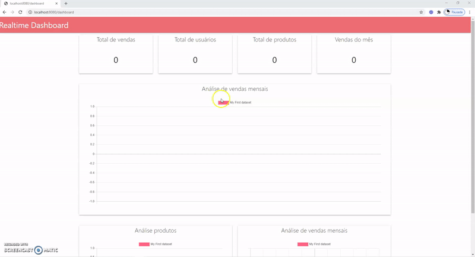

# Projeto: Dashboard em Real-Time

### Objetivos

Este projeto tem como objetivo colocar em prática meus conhecimentos de desenvolvimento back-end e Node.js 
na criação de um dashboard em tempo real baseado em operações de CRUD relacionadas a lançamento de vendas.

O usuário terá a possibilidade de registra seus produtos, quais são suas categorias e fornecedores, e em seguida
registrar quais foram as vendas destes produtos, e a cada venda lançada, o dashboard principal será atualizado 
em tempo real conforme cada venda é lançada.

### Motivação

Minha motivação foi de juntar meus conhecimentos em desenvolvimento back-end e front-end com a análise de dados,
unindo as duas áreas na tentativa de entregar uma ferramenta que corresponde ao objetivo de muitos gestores e 
tomadores de decisão: saber o que está acontecendo na hora, em tempo real!

### Tecnologias

* Javascript ES6
* Node.js
* Express.js
* Socket.io
* MongoDB
* Handlebars
* Arquitetura de API REST e MVC
* arqui
* HTML
* Materialize CSS
* Chart.js

### Instalação

Para instalar o projeto, execute o comando:

`yarn`

### Executando

Para executar o projeto, rode o comando:

`yarn start`

O projeto estará disponível no endereço: `http://localhost:8080`.

### Autor

### Victor Hugo Negrisoli
#### Desenvolvedor Full-Stack Pleno & Analista de Dados
